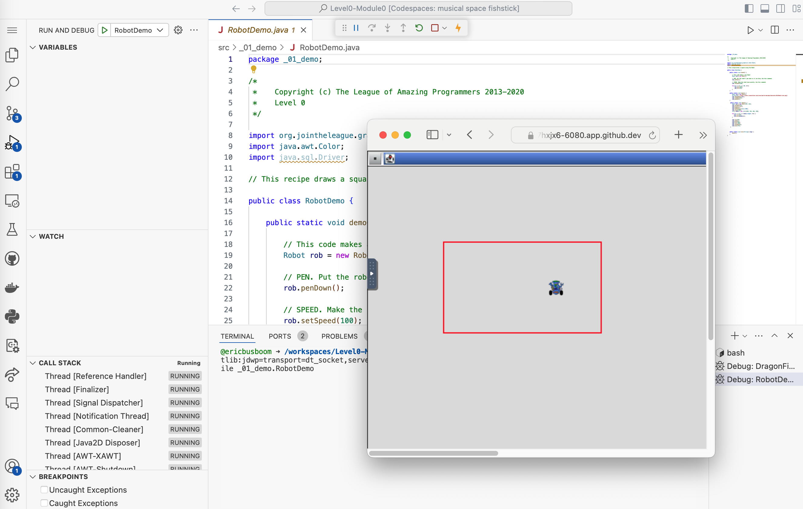

# 01 Demo

For our first Java program, we're going to run a program that creates a
rectangle on the screen, but to do that, you will have to first learn how to
work with code files in the LEAGUE's development environment. 

Visit this [Guide to Using Module Repositories](https://curriculum.jointheleague.org/java/module_repos.html) and follow the instructions to fork this module and run the demo program, or watch the video below. For convience, here is the green button you'll have to press to fork the module:

{{ forkrepo(fm_level, fm_module) }}
 

<iframe width="700" height="525" src="https://www.youtube.com/embed/svTv-EmyU5c?si=7ZW8UjqhLbThYNSg" title="YouTube video player" frameborder="0" allow="accelerometer; autoplay; clipboard-write; encrypted-media; gyroscope; picture-in-picture; web-share" referrerpolicy="strict-origin-when-cross-origin" allowfullscreen></iframe>

*If you have already started a codespace,* clicking on the green "Code" button will give you a 
popup like this:

 

Just click on one of the crazy names to open up that codespace. 

When you are done, you will have started a java program to draw a red square. 

 

Now go to the next lesson, **02 Code Flow**. 